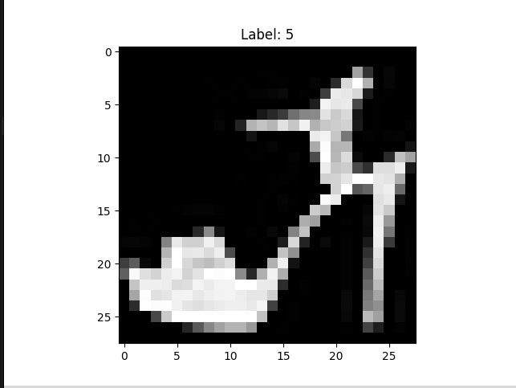
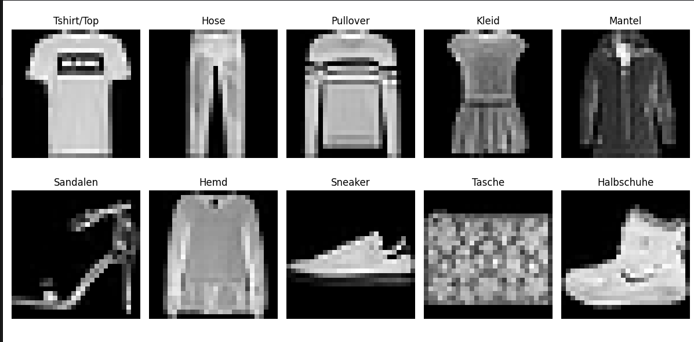
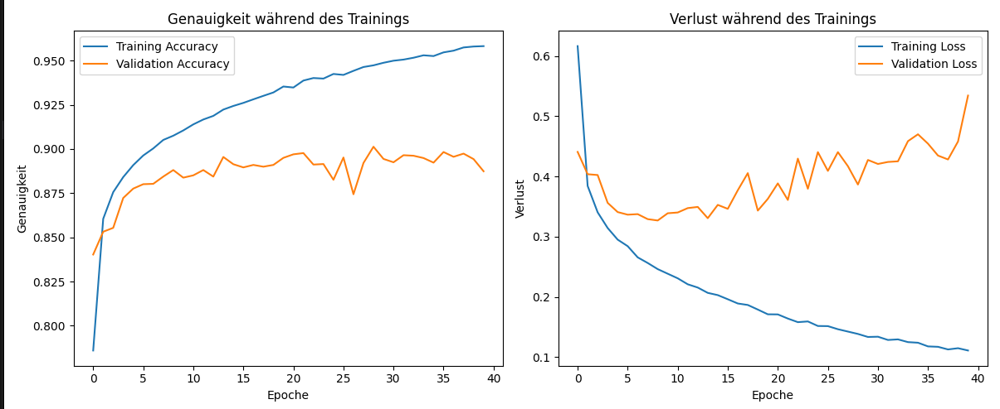
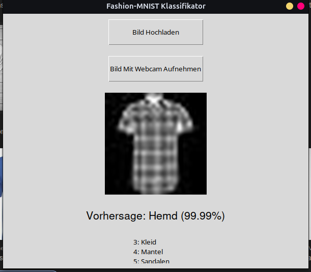

# Die Aufgabe

als Aufgabe 5 haben wir ein Neuronal Network implementiert, welches die MNIST-Datenbank klassifiziert. Die MNIST-Datenbank besteht aus 60.000 Trainingsdaten und 10.000 Testdaten. Jedes Bild ist 28x28 Pixel groß und zeigt eine handgeschriebene Zahl zwischen 0 und 9. Die Aufgabe besteht darin, ein Neuronal Network zu implementieren, welches die Zahlen korrekt klassifiziert.

## 1. 

Als erstes müsssen wir den Datensatz loaden so das wir ihn verwenden können. Dafür haben wir die Funktion `load_data()` implementiert. Diese Funktion lädt die Datenbank und gibt die Trainings- und Testdaten zurück.

```python
import numpy as np
import tensorflow as tf
from tensorflow.keras.datasets import fashion_mnist
import matplotlib.pyplot as plt


# Laden des Datensatzes
(x_train, y_train), (x_test, y_test) = fashion_mnist.load_data()

# Dimensionen der Trainings- und Testdaten
print(f"x_train shape: {x_train.shape}")  # (60000, 28, 28)
print(f"y_train shape: {y_train.shape}")  # (60000,)
print(f"x_test shape: {x_test.shape}")    # (10000, 28, 28)
print(f"y_test shape: {y_test.shape}")    # (10000,) 

# Häufigkeiten der Kategorien
unique, counts = np.unique(y_train, return_counts=True)
category_counts = dict(zip(unique, counts))
print("Anzahl der Kleidungsstücke pro Kategorie (Trainingsdaten):")
for k, v in category_counts.items():
    print(f"{k}: {v}")


# Trainingsdaten
unique_train, counts_train = np.unique(y_train, return_counts=True)
train_category_counts = dict(zip(unique_train, counts_train))
print("Trainingsdaten:")
for k, v in train_category_counts.items():
    print(f"{k}: {v}")

# Testdaten
unique_test, counts_test = np.unique(y_test, return_counts=True)
test_category_counts = dict(zip(unique_test, counts_test))
print("Testdaten:")
for k, v in test_category_counts.items():
    print(f"{k}: {v}")

index = 9
pixels = x_train[index]
label = y_train[index]
print(f"Kategorie des zehnten Bildes: {label}")

# Anzeigen des Bildes
plt.imshow(pixels, cmap='gray')
plt.title(f"Label: {label}")
plt.show()

import os
from PIL import Image

# Basisverzeichnis
base_dir = "/home/luna/5BHWII/INFI_Informations_Systeme/Aufgabe_5/data"

# Kategorienamen (optional, zur besseren Lesbarkeit)
categories = {
    0: "Tshirt/Top",
    1: "Hose",
    2: "Pullover",
    3: "Kleid",
    4: "Mantel",
    5: "Sandalen",
    6: "Hemd",
    7: "Sneaker",
    8: "Tasche",
    9: "Halbschuhe"
}

# Erstellen der Verzeichnisse für jede Kategorie
for label, name in categories.items():
    dir_path = os.path.join(base_dir, name)
    os.makedirs(dir_path, exist_ok=True)

# Export der Trainingsbilder
for i in range(len(x_train)):
    img_array = x_train[i]
    label = y_train[i]
    img = Image.fromarray(img_array)
    img = img.convert("L")
    category_name = categories[label]
    img.save(os.path.join(base_dir, category_name, f"{i}.jpeg"))
    
    # Optional: Begrenzung der Anzahl der Bilder pro Kategorie
    # z.B. nur die ersten 1000 pro Kategorie speichern
    # Dies kann durch zusätzliche Logik implementiert werden


import matplotlib.pyplot as plt

fig, axes = plt.subplots(2, 5, figsize=(12, 6))
for i, ax in enumerate(axes.flatten()):
    img = x_train[y_train == i][0]
    ax.imshow(img, cmap='gray')
    ax.set_title(categories[i])
    ax.axis('off')
plt.tight_layout()
plt.show()
```

Importieren der Bibliotheken:

numpy für numerische Operationen.
tensorflow und tensorflow.keras.datasets für das Laden des Datensatzes.
matplotlib.pyplot für die Visualisierung.
Laden des Datensatzes:

fashion_mnist.load_data() lädt den Fashion MNIST-Datensatz, der in Trainings- und Testdaten aufgeteilt ist.
x_train und y_train enthalten die Trainingsbilder und deren zugehörige Labels.
x_test und y_test enthalten die Testbilder und deren zugehörige Labels.
Ausgabe der Dimensionen:

Die Dimensionen der Trainings- und Testdaten werden ausgegeben, um die Struktur der Daten zu überprüfen.
Analyse der Kategorien:

Die Häufigkeiten der verschiedenen Kategorien (Labels) in den Trainingsdaten werden berechnet und ausgegeben.
Die Häufigkeiten der Kategorien in den Testdaten werden ebenfalls berechnet und ausgegeben.
Anzeige eines Beispiels:

Das Skript wählt das zehnte Bild aus den Trainingsdaten aus und gibt dessen Kategorie (Label) aus.

Anzeigen des Bildes:


Alle bilder sind in Graustufen und haben eine Größe von 28x28 Pixeln. Damit es für das Neuronal Network einfacher ist, die Bilder zu verarbeiten, werden die Pixelwerte normalisiert, indem sie durch 255 geteilt werden. Dies stellt sicher, dass die Pixelwerte im Bereich von 0 bis 1 liegen.

Beispiel aus jder der 10 Kategorien:



# Training 

wir verwenden Keras um das Neuronal Network zu implementieren. Dafür haben wir die Funktion `train_model()` implementiert. Diese Funktion erstellt ein einfaches Neuronal Network mit einer Input-Schicht, einer versteckten Schicht und einer Output-Schicht. Das Modell wird mit den Trainingsdaten trainiert und die Genauigkeit auf den Testdaten wird berechnet.

## Aufbau:

Als erstes müssen wir wieder alle daten laden und dann das neuronale Netzwerk bauen also das Modelstruktur festlegen:

Das sieht dan folgender maßen aus:

```cmd 
Modellübersicht:
Model: "sequential"
┏━━━━━━━━━━━━━━━━━━━━━━━━━━━━━━━━━┳━━━━━━━━━━━━━━━━━━━━━━━━┳━━━━━━━━━━━━━━━┓
┃ Layer (type)                    ┃ Output Shape           ┃       Param # ┃
┡━━━━━━━━━━━━━━━━━━━━━━━━━━━━━━━━━╇━━━━━━━━━━━━━━━━━━━━━━━━╇━━━━━━━━━━━━━━━┩
│ dense (Dense)                   │ (None, 512)            │       401,920 │
├─────────────────────────────────┼────────────────────────┼───────────────┤
│ dense_1 (Dense)                 │ (None, 256)            │       131,328 │
├─────────────────────────────────┼────────────────────────┼───────────────┤
│ dense_2 (Dense)                 │ (None, 128)            │        32,896 │
├─────────────────────────────────┼────────────────────────┼───────────────┤
│ dense_3 (Dense)                 │ (None, 24)             │         3,096 │
├─────────────────────────────────┼────────────────────────┼───────────────┤
│ dense_4 (Dense)                 │ (None, 10)             │           250 │
├─────────────────────────────────┼────────────────────────┼───────────────┤
│ dense_5 (Dense)                 │ (None, 10)             │           110 │
└─────────────────────────────────┴────────────────────────┴───────────────┘
 Total params: 569,600 (2.17 MB)
 Trainable params: 569,600 (2.17 MB)
 Non-trainable params: 0 (0.00 B)
```

Ich habe mich für ein relativ großes Netz entschieden von 6 layern. 

```python
model = models.Sequential([
    layers.Input(shape=(28 * 28,)),                  # Eingabeschicht
    layers.Dense(512, activation='relu'),            # Erste versteckte Schicht mit 512 Neuronen
    layers.Dense(256, activation='relu'),            # Erste versteckte Schicht mit 256 Neuronen
    layers.Dense(128, activation='relu'),            # Erste versteckte Schicht mit 128 Neuronen
    layers.Dense(24, activation='relu'),             # Zweite versteckte Schicht mit 24 Neuronen
    layers.Dense(10, activation='relu'),             # Dritte versteckte Schicht mit 10 Neuronen
    layers.Dense(num_classes, activation='softmax')  # Ausgabeschicht mit 10 Neuronen
])
```

## training:

Das Modell wird mit den Trainingsdaten trainiert. Das sieht dann volgendermaßen aus:

```cmd
5. Training des Modells
2024-12-10 15:51:53.263043: W external/local_xla/xla/tsl/framework/cpu_allocator_impl.cc:83] Allocation of 188160000 exceeds 10% of free system memory.
Epoch 1/40
   1/1875 ━━━━━━━━━━━━━━━━━━━━ 27:42 887ms/step - accuracy: 0.1875 - loss: 2.293  19/1875 ━━━━━━━━━━━━━━━━━━━━ 5s 3ms/step - accuracy: 0.2185 - loss: 2.1130    15161624/1161717171859/1875 ━━━━1875/1875 ━━━━━━━━━━━━━━━━━━━━ 6s 3ms/step - accuracy: 0.6977 - loss: 0.8906 - val_accuracy: 0.8403 - val_loss: 0.4407
Epoch 2/40
1875/1875 ━━━━━━━━━━━━━━━━━━━━ 5s 2ms/step - accuracy: 0.8563 - loss: 0.3941 - val_accuracy: 0.8532 - val_loss: 0.4036
Epoch 3/40
1875/1875 ━━━━━━━━━━━━━━━━━━━━ 5s 2ms/step - accuracy: 0.8742 - loss: 0.3467 - val_accuracy: 0.8554 - val_loss: 0.4023
Epoch 4/40
1875/1875 ━━━━━━━━━━━━━━━━━━━━ 5s 2ms/step - accuracy: 0.8867 - loss: 0.3071 - val_accuracy: 0.8723 - val_loss: 0.3561
Epoch 5/40
1875/1875 ━━━━━━━━━━━━━━━━━━━━ 5s 2ms/step - accuracy: 0.8900 - loss: 0.2994 - val_accuracy: 0.8776 - val_loss: 0.3408
Epoch 6/40
1875/1875 ━━━━━━━━━━━━━━━━━━━━ 5s 3ms/step - accuracy: 0.8999 - loss: 0.2723 - val_accuracy: 0.8801 - val_loss: 0.3365
Epoch 7/40
1875/1875 ━━━━━━━━━━━━━━━━━━━━ 5s 2ms/step - accuracy: 0.8983 - loss: 0.2717 - val_accuracy: 0.8803 - val_loss: 0.3374
Epoch 8/40
1875/1875 ━━━━━━━━━━━━━━━━━━━━ 5s 2ms/step - accuracy: 0.9062 - loss: 0.2549 - val_accuracy: 0.8844 - val_loss: 0.3291
Epoch 9/40
1875/1875 ━━━━━━━━━━━━━━━━━━━━ 5s 2ms/step - accuracy: 0.9080 - loss: 0.2469 - val_accuracy: 0.8881 - val_loss: 0.3268
Epoch 10/40
1875/1875 ━━━━━━━━━━━━━━━━━━━━ 5s 2ms/step - accuracy: 0.9116 - loss: 0.2362 - val_accuracy: 0.8838 - val_loss: 0.3388
Epoch 11/40
1875/1875 ━━━━━━━━━━━━━━━━━━━━ 5s 2ms/step - accuracy: 0.9148 - loss: 0.2280 - val_accuracy: 0.8851 - val_loss: 0.3401
Epoch 12/40
1875/1875 ━━━━━━━━━━━━━━━━━━━━ 5s 2ms/step - accuracy: 0.9178 - loss: 0.2185 - val_accuracy: 0.8881 - val_loss: 0.3474
Epoch 13/40
1875/1875 ━━━━━━━━━━━━━━━━━━━━ 5s 3ms/step - accuracy: 0.9197 - loss: 0.2127 - val_accuracy: 0.8844 - val_loss: 0.3493
Epoch 14/40
1875/1875 ━━━━━━━━━━━━━━━━━━━━ 5s 2ms/step - accuracy: 0.9232 - loss: 0.2049 - val_accuracy: 0.8955 - val_loss: 0.3306
Epoch 15/40
1875/1875 ━━━━━━━━━━━━━━━━━━━━ 5s 2ms/step - accuracy: 0.9259 - loss: 0.1976 - val_accuracy: 0.8914 - val_loss: 0.3527
Epoch 16/40
1875/1875 ━━━━━━━━━━━━━━━━━━━━ 5s 2ms/step - accuracy: 0.9278 - loss: 0.1928 - val_accuracy: 0.8896 - val_loss: 0.3462
Epoch 17/40
1875/1875 ━━━━━━━━━━━━━━━━━━━━ 5s 2ms/step - accuracy: 0.9292 - loss: 0.1852 - val_accuracy: 0.8910 - val_loss: 0.3770
Epoch 18/40
1875/1875 ━━━━━━━━━━━━━━━━━━━━ 5s 2ms/step - accuracy: 0.9309 - loss: 0.1825 - val_accuracy: 0.8900 - val_loss: 0.4054
Epoch 19/40
1875/1875 ━━━━━━━━━━━━━━━━━━━━ 5s 2ms/step - accuracy: 0.9317 - loss: 0.1765 - val_accuracy: 0.8910 - val_loss: 0.3432
Epoch 20/40
1875/1875 ━━━━━━━━━━━━━━━━━━━━ 5s 2ms/step - accuracy: 0.9363 - loss: 0.1688 - val_accuracy: 0.8950 - val_loss: 0.3627
Epoch 21/40
1875/1875 ━━━━━━━━━━━━━━━━━━━━ 5s 3ms/step - accuracy: 0.9360 - loss: 0.1711 - val_accuracy: 0.8970 - val_loss: 0.3884
Epoch 22/40
1875/1875 ━━━━━━━━━━━━━━━━━━━━ 5s 2ms/step - accuracy: 0.9402 - loss: 0.1586 - val_accuracy: 0.8977 - val_loss: 0.3609
Epoch 23/40
1875/1875 ━━━━━━━━━━━━━━━━━━━━ 5s 3ms/step - accuracy: 0.9410 - loss: 0.1563 - val_accuracy: 0.8912 - val_loss: 0.4295
Epoch 24/40
1875/1875 ━━━━━━━━━━━━━━━━━━━━ 5s 3ms/step - accuracy: 0.9408 - loss: 0.1549 - val_accuracy: 0.8915 - val_loss: 0.3795
Epoch 25/40
1875/1875 ━━━━━━━━━━━━━━━━━━━━ 5s 3ms/step - accuracy: 0.9453 - loss: 0.1453 - val_accuracy: 0.8826 - val_loss: 0.4403
Epoch 26/40
1875/1875 ━━━━━━━━━━━━━━━━━━━━ 5s 2ms/step - accuracy: 0.9426 - loss: 0.1515 - val_accuracy: 0.8952 - val_loss: 0.4092
Epoch 27/40
1875/1875 ━━━━━━━━━━━━━━━━━━━━ 5s 2ms/step - accuracy: 0.9440 - loss: 0.1456 - val_accuracy: 0.8744 - val_loss: 0.4403
Epoch 28/40
1875/1875 ━━━━━━━━━━━━━━━━━━━━ 5s 2ms/step - accuracy: 0.9487 - loss: 0.1354 - val_accuracy: 0.8921 - val_loss: 0.4170
Epoch 29/40
1875/1875 ━━━━━━━━━━━━━━━━━━━━ 5s 2ms/step - accuracy: 0.9490 - loss: 0.1358 - val_accuracy: 0.9013 - val_loss: 0.3865
Epoch 30/40
1875/1875 ━━━━━━━━━━━━━━━━━━━━ 5s 2ms/step - accuracy: 0.9501 - loss: 0.1300 - val_accuracy: 0.8944 - val_loss: 0.4273
Epoch 31/40
1875/1875 ━━━━━━━━━━━━━━━━━━━━ 5s 2ms/step - accuracy: 0.9514 - loss: 0.1284 - val_accuracy: 0.8925 - val_loss: 0.4207
Epoch 32/40
1875/1875 ━━━━━━━━━━━━━━━━━━━━ 5s 2ms/step - accuracy: 0.9519 - loss: 0.1252 - val_accuracy: 0.8965 - val_loss: 0.4240
Epoch 33/40
1875/1875 ━━━━━━━━━━━━━━━━━━━━ 5s 3ms/step - accuracy: 0.9533 - loss: 0.1255 - val_accuracy: 0.8962 - val_loss: 0.4251
Epoch 34/40
1875/1875 ━━━━━━━━━━━━━━━━━━━━ 5s 3ms/step - accuracy: 0.9547 - loss: 0.1212 - val_accuracy: 0.8949 - val_loss: 0.4585
Epoch 35/40
1875/1875 ━━━━━━━━━━━━━━━━━━━━ 5s 3ms/step - accuracy: 0.9546 - loss: 0.1185 - val_accuracy: 0.8923 - val_loss: 0.4699
Epoch 36/40
1875/1875 ━━━━━━━━━━━━━━━━━━━━ 5s 2ms/step - accuracy: 0.9555 - loss: 0.1157 - val_accuracy: 0.8983 - val_loss: 0.4543
Epoch 37/40
1875/1875 ━━━━━━━━━━━━━━━━━━━━ 5s 3ms/step - accuracy: 0.9575 - loss: 0.1133 - val_accuracy: 0.8956 - val_loss: 0.4346
Epoch 38/40
1875/1875 ━━━━━━━━━━━━━━━━━━━━ 5s 2ms/step - accuracy: 0.9588 - loss: 0.1082 - val_accuracy: 0.8974 - val_loss: 0.4281
Epoch 39/40
1875/1875 ━━━━━━━━━━━━━━━━━━━━ 5s 2ms/step - accuracy: 0.9584 - loss: 0.1101 - val_accuracy: 0.8943 - val_loss: 0.4580
Epoch 40/40
1875/1875 ━━━━━━━━━━━━━━━━━━━━ 5s 2ms/step - accuracy: 0.9607 - loss: 0.1044 - val_accuracy: 0.8874 - val_loss: 0.5342
Training abgeschlossen.
```


Visualisierung der Trainingskurven:



Die Accuracy und der Loss werden für Trainings- und Testdaten in Abhängigkeit der Epochen visualisiert.
 ```cmd
 6. Bewertung des Modells
313/313 - 0s - 850us/step - accuracy: 0.8874 - loss: 0.5342
Test loss: 0.5341982245445251
Test accuracy: 0.8873999714851379
Do some predictions on the test dataset and compare the results
313/313 ━━━━━━━━━━━━━━━━━━━━ 0s 729us/step
[9.1877562e-05 8.1394426e-22 9.9906176e-01 1.1235284e-07 5.2141317e-04
 2.2509876e-18 3.2456769e-04 5.7304848e-29 3.1368586e-07 3.5036466e-20]
```

Das trainierte Modell wird auf den Testdaten bewertet. Die Genauigkeit und der Loss werden ausgegeben.

nun speichern wir das Model ab. 

Das Modell wird in einer Datei mit dem Namen "fashion_mnist_model.h5" gespeichert. Dies ermöglicht es uns, das Modell später zu laden und Vorhersagen zu treffen, ohne es erneut trainieren zu müssen.

# Verwendung des Modells

um das Modell zu verwenden müssen wir es zuerst laden. Das sieht dann folgendermaßen aus:

```python
# Modell laden
model_path = 'fashion_mnist_model.h5'
if not os.path.exists(model_path):
    raise FileNotFoundError(f"Das Modell wurde nicht gefunden unter '{model_path}'. Stelle sicher, dass das Modell existiert.")

model = load_model(model_path)
print("Modell erfolgreich geladen.")
```

Das Modell wird aus der Datei "fashion_mnist_model.h5" geladen. Wenn die Datei nicht gefunden wird, wird eine Fehlermeldung ausgegeben.

Wir müssen nun einen "Predictor erstellen" um das Model zu verwenden. Das sieht dann folgendermaßen aus:

```python
# Funktion zur Vorhersage
def predict_image(img_array):
    prediction = model.predict(img_array)
    predicted_class = np.argmax(prediction, axis=1)[0]
    confidence = np.max(prediction) * 100
    return predicted_class, confidence
```

Wir müssen Natürlich auch die Bilder laden und vorbereiten. Das sieht dann folgendermaßen aus:

```python
# Funktion zur Vorverarbeitung des Bildes
def preprocess_image(image_path):
    try:
        # Bild öffnen
        img = Image.open(image_path).convert('L')  # Graustufen

        # Größe anpassen
        img = ImageOps.fit(img, (28, 28), Image.Resampling.LANCZOS)

        # In numpy Array umwandeln
        img_array = np.array(img)

        # Normalisieren
        img_array = img_array.astype('float32') / 255.0

        # Flachlegen
        img_array = img_array.reshape(1, 28 * 28)

        return img_array, img
    except Exception as e:
        messagebox.showerror("Fehler", f"Fehler bei der Vorverarbeitung des Bildes: {e}")
        return None, None
```

Ich habe des weiteren noch ein Graphisches Interface erstellt um das Model zu verwenden. Das sieht dann folgendermaßen aus:



in der CMD sieht das dann folgendermaßen aus:

```cmd
(venv) ┌─[luna@luna-thinkpad] - [~/5BHWII/INFI_Informations_Systeme/Aufgabe_5] - [Do Dez 12, 13:36]
└─[$] <git:(main*)> python3 predictor.py
2024-12-12 13:36:26.962991: I external/local_xla/xla/tsl/cuda/cudart_stub.cc:32] Could not find cuda drivers on your machine, GPU will not be used.
2024-12-12 13:36:26.967224: I external/local_xla/xla/tsl/cuda/cudart_stub.cc:32] Could not find cuda drivers on your machine, GPU will not be used.
2024-12-12 13:36:26.978174: E external/local_xla/xla/stream_executor/cuda/cuda_fft.cc:477] Unable to register cuFFT factory: Attempting to register factory for plugin cuFFT when one has already been registered
WARNING: All log messages before absl::InitializeLog() is called are written to STDERR
E0000 00:00:1734006986.992798   54865 cuda_dnn.cc:8310] Unable to register cuDNN factory: Attempting to register factory for plugin cuDNN when one has already been registered
E0000 00:00:1734006986.996374   54865 cuda_blas.cc:1418] Unable to register cuBLAS factory: Attempting to register factory for plugin cuBLAS when one has already been registered
2024-12-12 13:36:27.010812: I tensorflow/core/platform/cpu_feature_guard.cc:210] This TensorFlow binary is optimized to use available CPU instructions in performance-critical operations.
To enable the following instructions: AVX2 FMA, in other operations, rebuild TensorFlow with the appropriate compiler flags.
2024-12-12 13:36:29.185921: E external/local_xla/xla/stream_executor/cuda/cuda_driver.cc:152] failed call to cuInit: INTERNAL: CUDA error: Failed call to cuInit: UNKNOWN ERROR (303)
WARNING:absl:Compiled the loaded model, but the compiled metrics have yet to be built. `model.compile_metrics` will be empty until you train or evaluate the model.
Modell erfolgreich geladen.
1/1 ━━━━━━━━━━━━━━━━━━━━ 0s 54ms/step
1/1 ━━━━━━━━━━━━━━━━━━━━ 0s 23ms/step
1/1 ━━━━━━━━━━━━━━━━━━━━ 0s 22ms/step
1/1 ━━━━━━━━━━━━━━━━━━━━ 0s 20ms/step
Warning: Ignoring XDG_SESSION_TYPE=wayland on Gnome. Use QT_QPA_PLATFORM=wayland to run on Wayland anyway.
1/1 ━━━━━━━━━━━━━━━━━━━━ 0s 21ms/step
1/1 ━━━━━━━━━━━━━━━━━━━━ 0s 21ms/step
```

# Fazit


