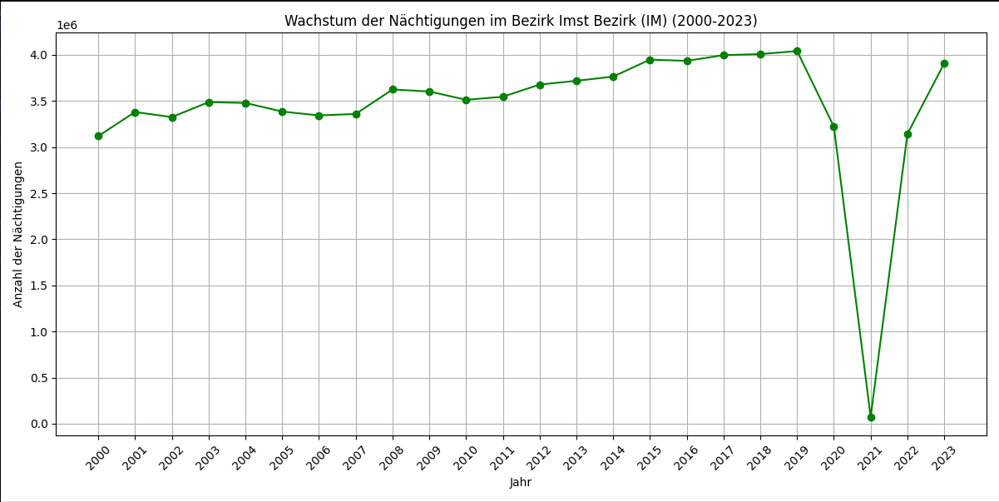
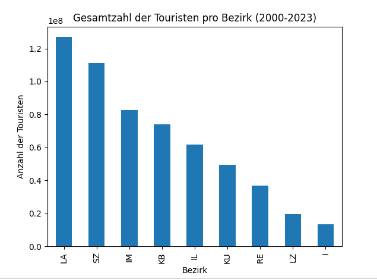
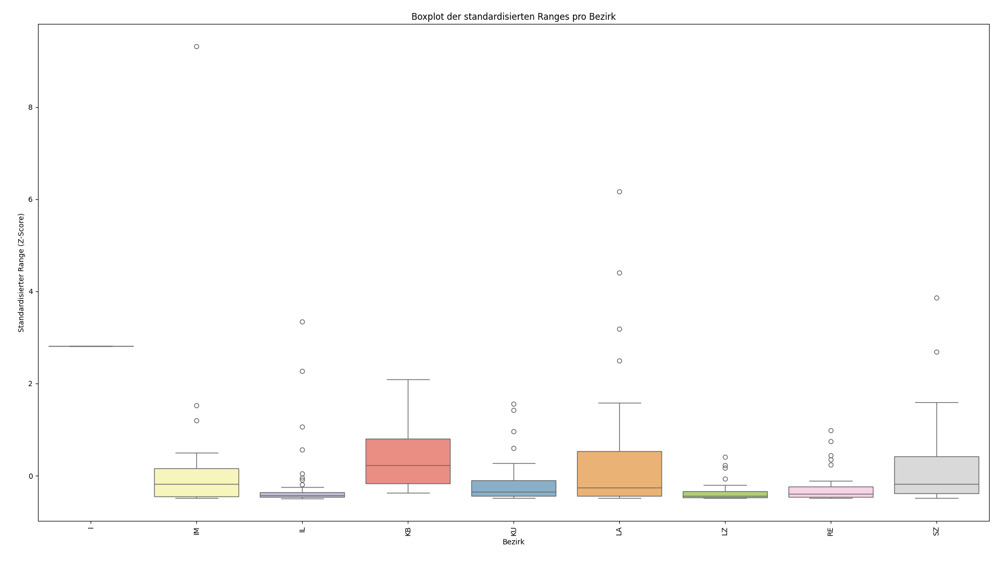
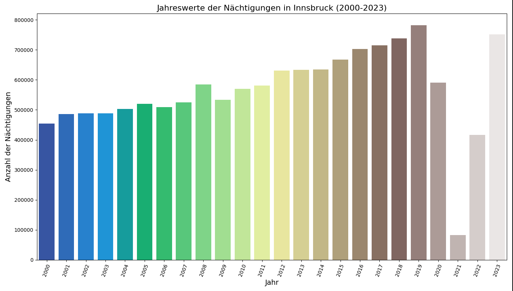

# Auswertung 2
## Auswertung aufgabe 2.1

Ausgabe eines Programms, das die Daten aus der Datei `Nächtigungen_Wintersaison.csv` einliest und die ersten fünf Zeilen des Datensatzes ausgibt. Anschließend werden alle vollständig leeren Zeilen entfernt und die ersten fünf Zeilen des bereinigten Datensatzes ausgegeben.

```python
rste fünf Zeilen des eingelesenen Datensatzes:
  Unnamed: 0 Unnamed: 1               Unnamed: 2  Zeitreihe Nächtigungen - Wintersaison  Unnamed: 4  Unnamed: 5  ...  Unnamed: 21  Unnamed: 22  Unnamed: 23  Unnamed: 24  Unnamed: 25  Unnamed: 26
0        NaN        NaN                      NaN                                    NaN         NaN         NaN  ...          NaN          NaN          NaN          NaN          NaN          NaN
1        Bez      Gemnr                 Gemeinde                                 2000.0      2001.0      2002.0  ...       2018.0       2019.0       2020.0       2021.0       2022.0       2023.0
2        NaN        NaN                      NaN                                    NaN         NaN         NaN  ...          NaN          NaN          NaN          NaN          NaN          NaN
3          I      70101   Innsbruck                                            454440.0    485436.0    488649.0  ...     737644.0     781571.0     591010.0      82662.0     416075.0     751321.0
4         IM      70201   Arzl im Pitztal                                       64265.0     65456.0     66883.0  ...      58347.0      57125.0      48123.0       2527.0      43862.0      57561.0

[5 rows x 27 columns]

Datensatz nach dem Entfernen von vollständig leeren Zeilen:
  Unnamed: 0 Unnamed: 1               Unnamed: 2  Zeitreihe Nächtigungen - Wintersaison  Unnamed: 4  Unnamed: 5  ...  Unnamed: 21  Unnamed: 22  Unnamed: 23  Unnamed: 24  Unnamed: 25  Unnamed: 26
1        Bez      Gemnr                 Gemeinde                                 2000.0      2001.0      2002.0  ...       2018.0       2019.0       2020.0       2021.0       2022.0       2023.0
3          I      70101   Innsbruck                                            454440.0    485436.0    488649.0  ...     737644.0     781571.0     591010.0      82662.0     416075.0     751321.0
4         IM      70201   Arzl im Pitztal                                       64265.0     65456.0     66883.0  ...      58347.0      57125.0      48123.0       2527.0      43862.0      57561.0
5         IM      70202   Haiming                                               33794.0     31345.0     41388.0  ...      78794.0      75370.0      61616.0       2349.0      53306.0      66827.0
6         IM      70203   Imst                                                  68501.0     78619.0     76394.0  ...      87831.0      96888.0      80854.0       4650.0      54387.0      69840.0

[5 rows x 27 columns]
```

Das Programm zeigt uns die ersten fünf Zeilen des eingelesenen Datensatzes und die ersten fünf Zeilen des bereinigten Datensatzes. Die vollständig leeren Zeilen wurden entfernt.

## Auswertung aufgabe 2.2

Nun wollen wir das schön Graphish darstellen. Dafür haben wir die Daten in ein Linien Diagramm geplottet. 
Welches uns schön zeigt wie sich die Nächtigungen in den Jahren 2000 bis 2023 entwickelt haben.



Hier sehen wir das die Nächtigungen stiegen bis auf das Corona Jahr 2020. Hier gab es einen starken Einbruch. Danach stiegen die Nächtigungen wieder an.

# 3. Berechnen von Werten

## Auswertung aufgabe 3.1

In dem Programm schauen wir uns das min, max und der Durchschnitt der Nächtigungen in den Jahren 2000 bis 2023 an.

das ist die Ausgabe des Programms:

```bash
DataFrame nach Hinzufügen der Statistiken:
   Bez    Gemnr                 Gemeinde      min       max     range            avg
0  NaN      NaN                      NaN      NaN       NaN       NaN            NaN
1    I  70101.0   Innsbruck               82662.0  781571.0  698909.0  566081.166667
2   IM  70201.0   Arzl im Pitztal          2527.0   68566.0   66039.0   56795.875000
3   IM  70202.0   Haiming                  2349.0   78794.0   76445.0   47864.208333
4   IM  70203.0   Imst                     4650.0  104521.0   99871.0   81489.708333

DataFrame nach Standardisierung des Range:
   Bez    Gemnr                 Gemeinde     range  range_min_max  range_z_score
0  NaN      NaN                      NaN       NaN            NaN            NaN
1    I  70101.0   Innsbruck               698909.0       0.336710       2.809634
2   IM  70201.0   Arzl im Pitztal          66039.0       0.031803      -0.179656
3   IM  70202.0   Haiming                  76445.0       0.036817      -0.130504
4   IM  70203.0   Imst                     99871.0       0.048103      -0.019854
```

# Auswertung aufgabe 3.2


In dieser Aufgabe werden wir:

Die Gesamtzahl an Touristen pro Jahr berechnen (Summe mit axis=0).
Diese Werte weiterverarbeiten, um die Gesamtzahl über alle Jahre zu erhalten (ein Wert).
Die Zusammenfassung nach Bezirken durchführen.

Das ist die Ausgabe des Programms:

```bash
Gesamtzahl an Touristen pro Jahr:
2000    22400614.0
2001    23503160.0
2002    23870576.0
2003    24345343.0
2004    24648277.0
2005    25047404.0
2006    24766815.0
2007    24062117.0
2008    25612058.0
2009    25584483.0
2010    25241464.0
2011    24830645.0
2012    25699115.0
2013    26220929.0
2014    25370402.0
2015    25960806.0
2016    26804089.0
2017    26463873.0
2018    27583016.0
2019    27485847.0
2020    22925568.0
2021      712998.0
2022    20909636.0
2023    25707235.0
dtype: float64

Gesamtzahl an Touristen über alle Jahre (2000-2023): 575756470

Gesamtzahl an Touristen pro Bezirk und Jahr:
          2000       2001       2002       2003       2004       2005       2006       2007  ...       2016       2017       2018       2019       2020      2021       2022       2023
Bez                                                                                          ...                                                                                       
I     454440.0   485436.0   488649.0   488026.0   503198.0   519628.0   508514.0   525369.0  ...   703027.0   714566.0   737644.0   781571.0   591010.0   82662.0   416075.0   751321.0
IL   2695482.0  2817605.0  2818643.0  2877890.0  2848108.0  2862165.0  2746198.0  2689356.0  ...  2754635.0  2753976.0  2839759.0  2825088.0  2346234.0  153956.0  1979656.0  2574959.0
IM   3118989.0  3380031.0  3324748.0  3486899.0  3478346.0  3384839.0  3342966.0  3358780.0  ...  3934628.0  3996585.0  4007929.0  4040985.0  3220353.0   72621.0  3143354.0  3907570.0
KB   3299273.0  3302253.0  3370049.0  3302787.0  3276529.0  3487816.0  3461141.0  3068808.0  ...  3290870.0  3193148.0  3416675.0  3388395.0  3003619.0   79644.0  2545629.0  3016557.0
KU   2051953.0  2114835.0  2200543.0  2229688.0  2264615.0  2337468.0  2311242.0  2117119.0  ...  2219915.0  2117717.0  2290156.0  2289522.0  2025658.0  137818.0  1650990.0  2022201.0
LA   4571046.0  4895042.0  5014988.0  5157259.0  5357281.0  5285917.0  5236414.0  5258407.0  ...  6081206.0  6052991.0  6239314.0  6164816.0  4937727.0   34502.0  4782399.0  5765445.0
LZ    743140.0   831620.0   794972.0   859215.0   887181.0   859249.0   815285.0   802413.0  ...   877061.0   837114.0   910228.0   898843.0   821573.0   63150.0   713975.0   886224.0
RE   1570801.0  1593337.0  1582563.0  1524654.0  1583540.0  1659832.0  1590544.0  1466832.0  ...  1693971.0  1607001.0  1733423.0  1763296.0  1510839.0   24109.0  1453525.0  1682301.0
SZ   3895490.0  4083001.0  4275421.0  4418925.0  4449479.0  4650490.0  4754511.0  4775033.0  ...  5248776.0  5190775.0  5407888.0  5333331.0  4468555.0   64536.0  4224033.0  5100657.0

[9 rows x 24 columns]
```

und Folgendes Diagramm zeigt die Gesamtzahl an Touristen pro Jahr pro Bezirk:



# 4. Gegenüberstellung von Bezirken

## 4.1 Auswertung aufgabe 4.1

Schritte:
Berechnung der standardisierten Ranges: Stellen Sie sicher, dass die standardisierten Ranges für jede Gemeinde berechnet wurden.
Erstellung des Boxplots: Nutzen Sie entweder die eingebauten Methoden von Pandas oder Seaborn für eine ansprechendere Darstellung mit individuellen Farben für jeden Bezirk.



Fazit:
Mit diesem Skript können Sie die standardisierten Ranges der einzelnen Bezirke als Boxplot darstellen, wobei jeder Bezirk eine eigene Farbe erhält. Die Verwendung von Seaborn bietet eine flexiblere und ästhetisch ansprechendere Möglichkeit zur Visualisierung im Vergleich zu den eingebauten Pandas-Methoden. Falls Sie weitere Anpassungen oder Unterstützung benötigen, lassen Sie es mich bitte wissen!


## 4.2 Auswertung aufgabe 4.2

Schritte:
- Daten einlesen und aufbereiten
- Filtern der Daten für Innsbruck
- Extrahieren der Jahreswerte
- Erstellen des Barplots mit Seaborn

Konsolen Ausgabe:

```bash

Umbenannte Spalten:
Index([     'Bez',    'Gemnr', 'Gemeinde',       2000,       2001,       2002,
             2003,       2004,       2005,       2006,       2007,       2008,
             2009,       2010,       2011,       2012,       2013,       2014,
             2015,       2016,       2017,       2018,       2019,       2020,
             2021,       2022,       2023],
      dtype='object')

Daten für Innsbruck:
Bez   Gemnr                Gemeinde     2000     2001     2002     2003     2004     2005     2006     2007     2008     2009     2010     2011     2012     2013     2014     2015     2016     2017     2018     2019     2020    2021     2022     2023
  I 70101.0  Innsbruck              454440.0 485436.0 488649.0 488026.0 503198.0 519628.0 508514.0 525369.0 584257.0 533182.0 569507.0 581081.0 631423.0 633126.0 634591.0 667645.0 703027.0 714566.0 737644.0 781571.0 591010.0 82662.0 416075.0 751321.0

Jahreswerte für Innsbruck:
2000: 454440 Nächtigungen
2001: 485436 Nächtigungen
2002: 488649 Nächtigungen
2003: 488026 Nächtigungen
2004: 503198 Nächtigungen
2005: 519628 Nächtigungen
2006: 508514 Nächtigungen
2007: 525369 Nächtigungen
2008: 584257 Nächtigungen
2009: 533182 Nächtigungen
2010: 569507 Nächtigungen
2011: 581081 Nächtigungen
2012: 631423 Nächtigungen
2013: 633126 Nächtigungen
2014: 634591 Nächtigungen
2015: 667645 Nächtigungen
2016: 703027 Nächtigungen
2017: 714566 Nächtigungen
2018: 737644 Nächtigungen
2019: 781571 Nächtigungen
2020: 591010 Nächtigungen
2021: 82662 Nächtigungen
2022: 416075 Nächtigungen
2023: 751321 Nächtigungen
/home/luna/5BHWII/INFI_Informations_Systeme/Uebung_3/Aufgabe_4_2.py:57: FutureWarning: 

Passing `palette` without assigning `hue` is deprecated and will be removed in v0.14.0. Assign the `x` variable to `hue` and set `legend=False` for the same effect.

  sns.barplot(x=labels, y=values, palette='terrain')
```



Fazit:
Mit diesem Skript können Sie die Anzahl der Touristen in Innsbruck für jedes Jahr von 2000 bis 2023 visualisieren. Die Verwendung von Seaborn bietet eine ästhetisch ansprechendere Möglichkeit zur Visualisierung im Vergleich zu den eingebauten Pandas-Methoden. 

# 5. Gegenüberstellung mit den Einwohnerzahlen

## 5.1 Auswertung aufgabe 5.1

Mit Diesem Skript werden die Einwohnerzahlen der Bezirke Innsbruck, Imst, Kufstein, Landeck, Reutte, Schwaz und Lienz aus der Datei `Einwohnerzahlen.csv` eingelesen und die ersten fünf Zeilen des Datensatzes ausgegeben.

```bash
Erste fünf Zeilen des eingelesenen Datensatzes:
  Unnamed: 0 Unnamed: 1               Unnamed: 2  Zeitreihe Einwohner  Unnamed: 4  Unnamed: 5  ...  Unnamed: 21  Unnamed: 22  Unnamed: 23  Unnamed: 24  Unnamed: 25  Unnamed: 26
0        NaN        NaN                      NaN                                    NaN         NaN         NaN  ...          NaN          NaN          NaN          NaN          NaN          NaN
1        Bez      Gemnr                 Gemeinde                                 2000.0      2001.0      2002.0  ...       2018.0       2019.0       2020.0       2021.0       2022.0       2023.0
2        NaN        NaN                      NaN                                    NaN         NaN         NaN  ...          NaN          NaN          NaN          NaN          NaN          NaN
3          I      70101   Innsbruck                                            117935.0    118112.0    118601.0  ...     132493.0     133838.0     134587.0     135128.0     135869.0     136587.0
4         IM      70201   Arzl im P
```

# Fazit


# Quellcode 

Aller Quellcode ist auf Github:
https://github.com/Luna-Schaetzle/INFI_Informations_Systeme

