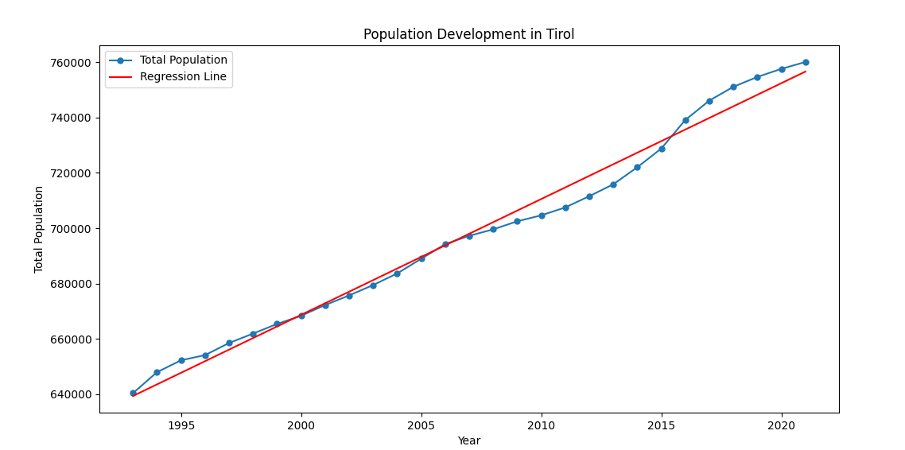
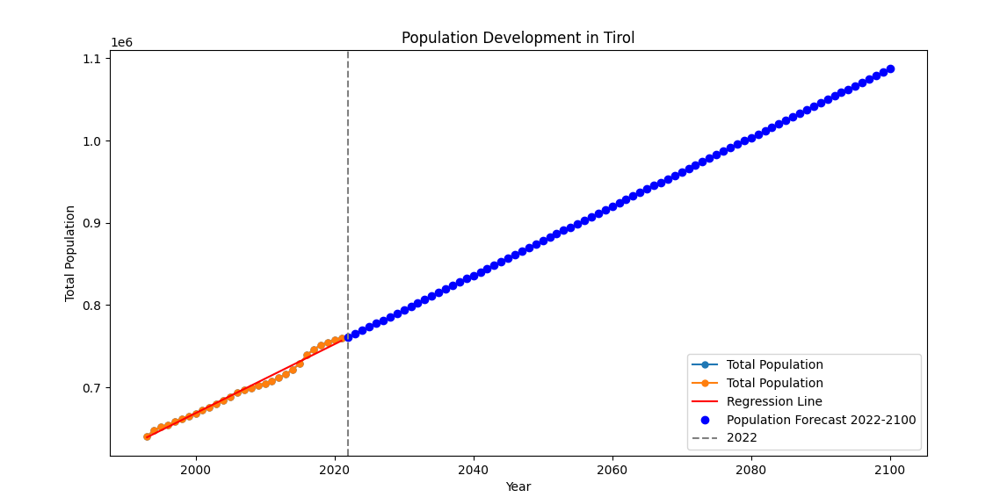
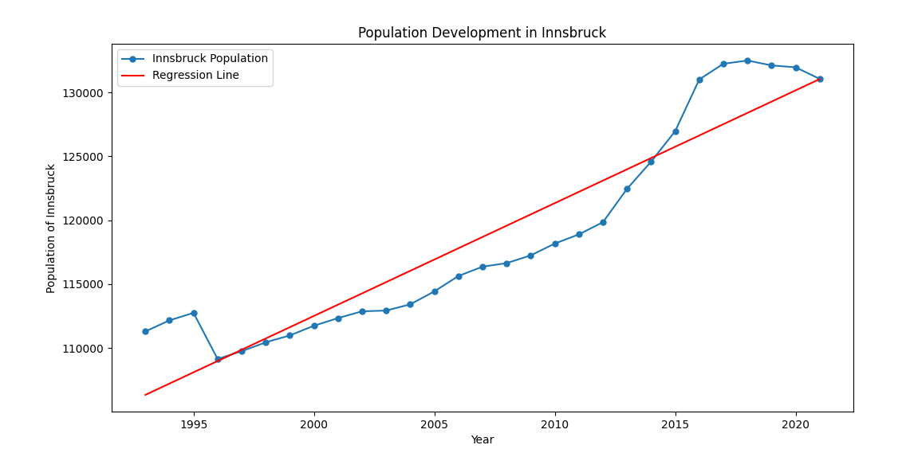
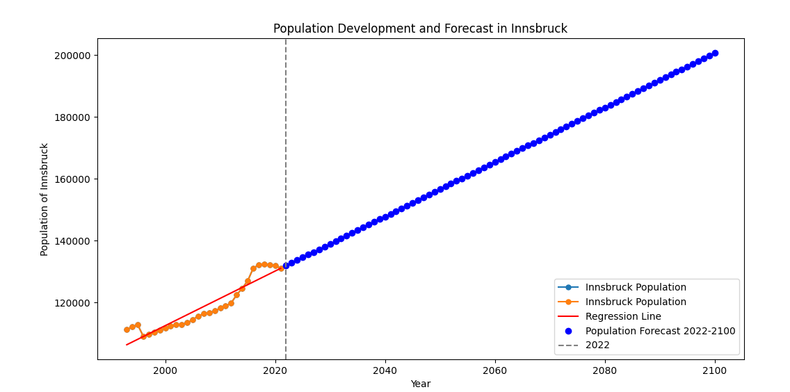
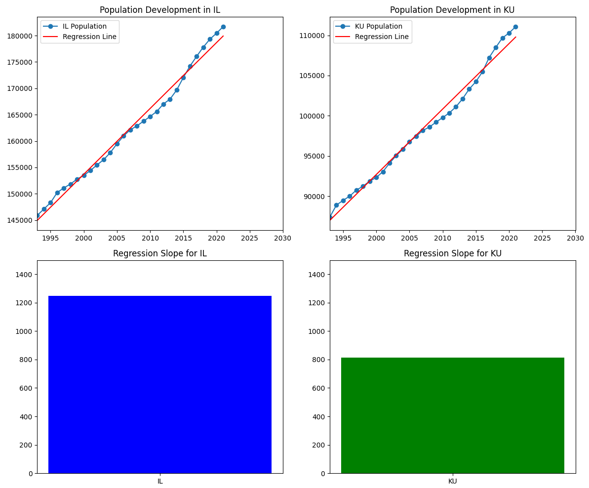

# Auswertung 

## Einleitung

In dieser Auswertung analysieren wir die Bevölkerungsentwicklung in Tirol, Innsbruck und verschiedenen Bezirken, basierend auf Daten aus einer CSV-Datei. Ziel ist es, historische Entwicklungen darzustellen, Prognosen für die Zukunft zu erstellen und Vergleiche zwischen verschiedenen Regionen zu ziehen. Für die Umsetzung wurden die Python-Bibliotheken `pandas`, `matplotlib` und `statsmodels` verwendet.

---

## Aufgabe 1: Daten einlesen

Zunächst haben wir die Bevölkerungsdaten aus der Datei `bev_tirol.csv` eingelesen. Die Daten stammen aus verschiedenen Zeiträumen und umfassen Bevölkerungszahlen für Tirol, Innsbruck und diverse Bezirke. Hierfür verwenden wir die Python-Bibliotheken `pandas` und `statsmodels`.

```python
import pandas as pd
import matplotlib.pyplot as plt
import statsmodels.api as sm

data = pd.read_csv("bev_tirol.csv", sep=";")
```

---

## Aufgabe 2: Bevölkerungsentwicklung in Tirol

### 2.1 Bevölkerungsentwicklung 

Die Bevölkerungsentwicklung in Tirol von 1990 bis 2022 wird in einem Liniendiagramm dargestellt. Die Daten zeigen den Verlauf der Gesamtbevölkerung über die Jahre.



Aus dem Diagramm ist ein mehr oder weniger konstanter Anstieg der Bevölkerung in Tirol erkennbar. Dieser langfristige Trend deutet auf ein stetiges Bevölkerungswachstum hin.

### 2.2 Prognose

Anhand der historischen Daten haben wir eine Prognose für die Bevölkerungsentwicklung bis ins Jahr 2030 erstellt. Dabei wurde ein lineares Regressionsmodell verwendet, das den aktuellen Trend fortführt.



Die Prognose zeigt, dass die Bevölkerung in Tirol weiterhin steigen wird, wenn der aktuelle Trend anhält. Allerdings sollten Prognosen immer mit Vorsicht betrachtet werden, da unvorhergesehene Ereignisse oder geografische Einschränkungen, wie das gebirgige Terrain in Tirol, die Entwicklung beeinflussen können.

---

## Aufgabe 3: Bevölkerungsentwicklung in Innsbruck

### 3.1 Bevölkerungsentwicklung in Innsbruck

Für Innsbruck haben wir die Bevölkerungsentwicklung separat analysiert. Die Daten zeigen, dass auch hier ein allgemeiner Aufwärtstrend erkennbar ist.



Im Vergleich zu Tirol sind die Schwankungen in Innsbruck jedoch stärker ausgeprägt. Insbesondere in den letzten Jahren gab es Rückgänge, die auf verschiedene Faktoren wie Abwanderung oder Veränderungen der Wohnsituation zurückzuführen sein könnten.

### 3.2 Prognose

Auch für Innsbruck haben wir eine Prognose bis zum Jahr 2030 erstellt.



Die Prognose zeigt, dass die Bevölkerungszahl in Innsbruck weiter steigen könnte, sofern sich der Rückgang der letzten Jahre nicht fortsetzt. Hier könnten Faktoren wie die Urbanisierung oder die Attraktivität der Stadt als Lebensraum eine Rolle spielen.


---

## Aufgabe 4: Gegenüberstellung der Bezirke

Für die Bezirke Innsbruck-Land (IL) und Kufstein (KU) wurde die Bevölkerungsentwicklung gegenübergestellt. Ziel war es, Unterschiede und Gemeinsamkeiten in den Entwicklungen zu identifizieren.



Die Bevölkerungsentwicklung in beiden Bezirken zeigt ähnliche Muster. Die Schwankungen verlaufen in ähnlichen Jahren, was auf gemeinsame externe Faktoren hinweisen könnte. Allerdings hat Kufstein eine geringere Gesamtbevölkerung im Vergleich zu Innsbruck-Land. Trotzdem weisen beide Bezirke ein vergleichbares Bevölkerungswachstum auf.

---

## Fazit

Die Analyse zeigt, dass Tirol insgesamt ein stetiges Bevölkerungswachstum aufweist. Innsbruck als urbanes Zentrum hat eine dynamischere Entwicklung mit stärkeren Schwankungen, während die Bezirke Innsbruck-Land und Kufstein ein ähnliches Wachstumsmuster zeigen. Prognosen bis 2030 deuten auf eine Fortsetzung des Wachstums hin, allerdings sollten mögliche externe Einflüsse berücksichtigt werden.

---

## Quellcode 

Der vollständige Quellcode zu dieser Auswertung ist auf GitHub verfügbar:
[GitHub Repository](https://github.com/Luna-Schaetzle/INFI_Informations_Systeme/tree/main/Uebung_4)
